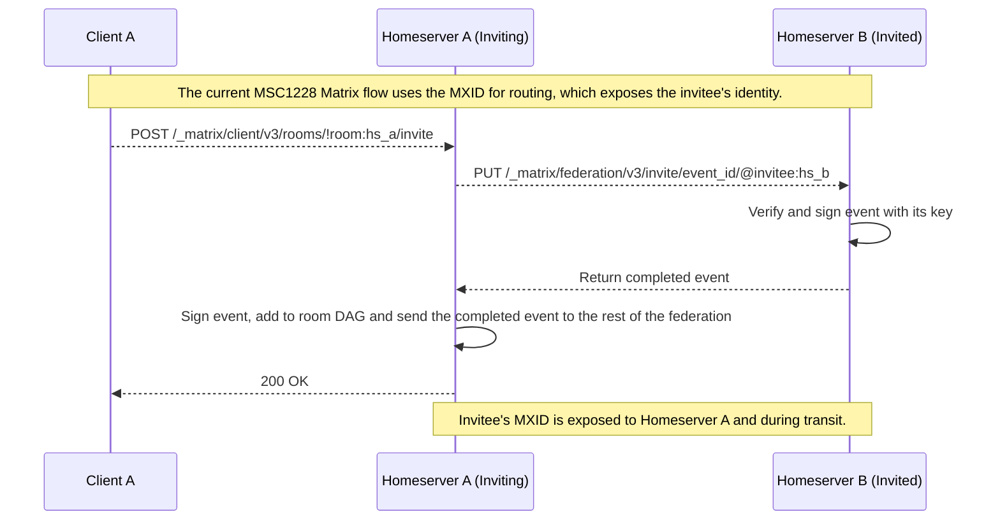
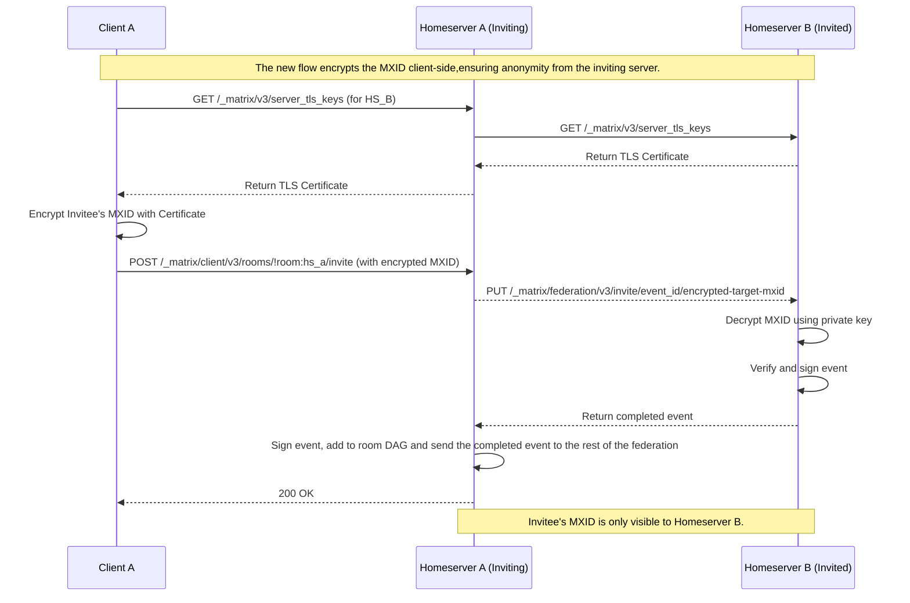

# Achieving User Pseudonymity in Federated End-to-End Encrypted Messaging Platforms

---

## 1. Introduction

End-to-end encryption (E2EE) has become a standard feature in modern messaging platforms like WhatsApp, Signal, and Telegram. While E2EE allows users to communicate without any third party knowing the contents of their messages, it does not hide metadata— information detailing who communicates with whom, when, and how often. This metadata allows platforms to track user activity and communication patterns.

Another significant drawback of these platforms is that they are not interoperable. This means that a user on platform A must have an account on platform B to message one of its users, impeding consumer choice and account portability. In the European Union, the [Digital Markets Act](https://digital-markets-act.ec.europa.eu/about-dma_en) was passed and has put pressure on "gatekeeper" messaging platforms to enable interoperability with third-party services. 

Matrix is a platform where this interoperability already exists by utilizing a federated model where messages are synced across a network of independent servers, all implementing the Matrix Protocol. The Matrix network is composed of Homeservers (software that hosts user accounts, bound to a single domain) and Clients (software that users use to send and receive events). Any individual, company, or organization can create their own homeserver or client, or join one an already existing one.

Users communicate by joining rooms, which are, by default, E2EE. A room is a series of JSON objects that are composed of state and message events. While the content of message events is encrypted, a Matrix a user's identity remains visible to any homeserver participating in a room's federation. This is because a user's unique Matrix identifier (MXID) is still used for message routing, and room state events—which contain metadata like membership changes—are unencrypted. 

This project aims to address these challenges by developing a prototype of an E2EE messaging platform that offers user anonymity from remote homeservers using open-source Matrix client and server source code.

## 2. Background 

### 2.1 Sealed Sender

In 2018, Signal introduced "Sealed Sender" to mitigate metadata leakage. This feature provides a form of one-way anonymity by encrypting the sender's identity within the original message. However, research has shown that this feature does not guarantee bidirectional anonymity or prevent server-side correlation ([here](https://www.ndss-symposium.org/ndss-paper/improving-signals-sealed-sender/)) and Signal is not currently interoperable with other platforms.

### 2.2 The Role of Matrix Identifiers (MXIDs)

An MXID, formatted as `@username:example.com`, is a user's unique, persistent identity in the Matrix network. MXIDs are fundamental to the protocol for several reasons:

- **Message Routing:** Remote homeservers use the server portion of an MXID to route events to the correct destination. ([Server-Server API](https://spec.matrix.org/v1.15/server-server-api/#resolving-server-names))
    
- **Authorization:** MXIDs are used to verify a user's power level and permissions within a room. ([Room Version Spec ](https://spec.matrix.org/v1.15/rooms/v10/#authorization-rules))
    
- **Key Management:** For E2EE, client device keys are associated with a user's MXID, allowing other clients to discover and exchange them securely.([Client-Server API](https://spec.matrix.org/v1.15/client-server-api/#post_matrixclientv3keysupload))
    
Given these core functions, MXIDs cannot be removed from the protocol entirely. Instead their functionality must be perserved while preventing their unnecessary exposure to untrusted homeservers.

### 2.3 The Privacy Risks in Federated Communication

In Matrix, users can choose their homeserver and their accounts by default do not need to be associated with any third-party identifier such as an email, phone number, or social media account. Users cannot control what homeservers  their contacts use. Thus, untrusted homeservers may tracked a user's activity across rooms, posing a privacy risk. Even with a proposal like MSC4014 (discussed below), the following metadata could still be used by foreign homeservers for tracking:

- **User Invites:** The routing for partial invites still uses the invitee's MXID, revealing who is being invited to a room.
    
- **`m.room.member` events:** The `state_key` field and the `user_id` within the `mxid_mapping` still contain the user's MXID, allowing homeservers to link a user to their room-bound pseudonym.

## 3. Proposed Approach

My project's core objective is to obfuscate a user's identity at the application level, ensuring that remote homeservers cannot link users to their activity in a room. To achieve this, I propose using room-bound pseudonyms, identities unique to a specific room and managed by the user's homeserver. This approach aims to remove MXIDs from the `sender` and `state_key` fields of relevant events.

### 3.1 Building on Existing Proposals

This approach is built upon Matrix Specification Change (MSC) proposal MSC4014 (Pseudonymous Identities), which is the successor to MSC1228 (Removing MXIDs from events). MSC4014's goal is to replace MXIDs with `sender_keys` (ed25519 public keys) scoped to a specific per-room, per-user identity managed by a user's homeserver to break the direct link between a user's ID and their activity. However, MSC4014's primary motivation was account portability, not user anonymity. As a result, it still introduces an `mxid_mapping` field in `m.room.member` events that explicitly contains the `user_id` field containing the MXID and the `sender_key`. I propose a stronger privacy model where the `mxid_mapping` is stripped of the user's localpart, preventing remote homeservers from linking a sender_key to a specific MXID.

### 3.2 A New Cryptographic Invitation Flow

The standard Matrix invite flow involves the inviting server building a complete invite event, which is then signed by both the inviting and invited servers before being added to the room's event graph. This is incompatible with a pseudonymous user IDs as when a client invites a user from a remote homeserver they do not yet know the invitees sender_key for this room.

I have designed a new cryptographic invitation flow that builds on the one proposed in MSC1228 that prevents revealing the inviter's MXID to the remote homeserver and the invitee's MXID to the inviter's homeserver. This is done by the client fetching the remote homeserver's TLS certificate via a new endpoint `/_matrix/v3/server_tls_keys` and using it to encrypt the invitee's MXID. 
    
**The MSC1228 invitation flow**    


**The proposed invitation flow**    


The new flow ensures that only Homeserver B can see the invitee's MXID. The inviting homeserver (A) and any intermediate homeservers only see an encrypted blob.

## 4. Implementation

### 4.1 Homeserver Modifications

The homeserver modification were implemented in the a fork of the Dendrite Matrix homeserver, a homeserver written in Go and maintained by Element, as it is regualarily used to experiement with new Matrix features and is the only homeserver where MSC4014 has currently been implemented.

Here are some of the main modifications: 

- **Modifying the internal architecture of the Dendrite homeserver to support the new invitation and event flows**: This included adding a new API route /server_tls_keys/{serverName} to handle requests for remote server TLS certificates. The federationapi was modified to handle encrypted invitations.

- **Designing a new cryptographic flow for user invitations:** This involved handling encrypted MXID invitations and creating a new mechanism for fetching a remote server's TLS certificate, which is required for the encryption.

- **Removing MXIDs from key event fields and federation routing paths:** The /make_join/{roomID}/{userID} endpoint was replaced with /make_join/{roomID}/{senderID} to use Sender IDs in the path for join requests. In room creation and join events for org.matrix.msc4014 rooms, the mxid_mapping was changed to only send the server domain, not the full MXID.

For more comprehensive list of modifications to [Dendrite](https://github.com/Ijnek117/dendrite/blob/anonymity-research/MODIFICATIONS.md) and [GoMatrixServerlib](https://github.com/Ijnek117/gomatrixserverlib/blob/anonymity-research/MODIFICATIONS.md) see the MODIFICATION.md files in both directories.

### 4.2 Client Modifications

No clients (that I found) supported create the new room type defined in MSC4014, 
thus the client modifications were implemented in a fork of the gomuks client. It was chosen as was a "minimal" that could be quickly modified and it was mainly written in Go.

Here are some of the main modifications: 

- **Designing a new cryptographic flow for user invitations:** The client was modified to encrypt the invitee's MXID using the homeserver's TLS certificate before sending the invitation. A new EncryptedUserID type was introduced to accommodate the encrypted localpart, which exceeds the standard MXID length limits.

- **Extending Gomucks to support the MSC4014 room type**: The setMembership command was modified to first encrypt the MXID and then send the invitation with the encrypted ID. The RoomVersion "org.matrix.msc4014" was added. An "Invite a user" button and corresponding function were added to the room context menu to allow for invites after room creation.

For more comprehensive list of modifications to [gomuks](https://github.com/Ijnek117/gomuks/blob/anonymity-research/MODIFICATIONS.md) and [mautrixgo](https://github.com/Ijnek117/mautrixgo/blob/anonymity-research/MODIFICATIONS.md) see the MODIFICATION.md files in both directories.

### Demonstration 

I set up two separate Dendrite homeserver instances and a clients on a single machine. A user on one homeserver followed the steps in the creating a room section of the [README](https://github.com/Ijnek117/anonymous-matrix/blob/main/README.md#4-creating-a-room) to send an invite with an encrypted MXID to a user on the second homeserver. The second homeserver successfully decrypted the MXID, and the invited user was able to join the room. The users could then continue to send messages to each other. Within the Dendrite roomserver and sync_api databases there were no occurances of any remote user MXIDs. This end-to-end test indicates that the modifications, from client encryption to server decryption, are working as intended.
 
## 5. Known Issues and Future Work

This project is a proof-of-concept and a work in progress. The following are known issues and potential areas for future development.

### Known Issues

* **[Cannot decrypt E2EE decrypted messages]**
  Messages in E2EE rooms cannot currently be decrypted due to the way device keys are managed in Dendrite. Device keys are currently associated with matrix userID and thus homeservers have no way of fetching of remote users' keys. Device keys will need to instead be associated with Sender IDs.

* **[Inviting multiple users the same remote homeserver]**
  Currently if an invitee is form a remote homeserver that is already in the room, the remote homeserver will receive the invite event twice; "once through the usual invite endpoint, and again through a federation transcation" ([spec](https://spec.matrix.org/v1.15/server-server-api/#put_matrixfederationv2inviteroomideventid)). I have not modified how federation transcation are handled and so for now the full invite sequence they return includes the invitee's full `userid` in the `mxid_mapping`.

### Future Work and Extensions

* **[Device tracking across E2EE rooms]**
  User activity between E2EE rooms may be tracked using the Curve25519 key contained in the `sender_key` field and their corresponding `device_id`s that are sent in events of type `m.room.encrypted` (encrypted messages). Work should be done to determine if and how this can be done.

* **[Changing mxid mappings]**
  The mxid_mapping that is used to map a user's `sender_id` to their `user_id` has not fully been removed, instead just the localpart of the `user_id` was deleted. Some federation functions such as `GetUserDevices()` still accept remote userIDs as parameters. These functions and their associated types should be refactored to instead take senderIDs as parameters. 

## 6. Appendix

The following JSON snippets illustrate the structure of events in matrix room. The goal was to replace or obfuscate the user-identifying fields (`sender`, `state_key`, `user_id` within `mxid_mapping`) are now all pseudonymous information.

An event of type `m.room.encrypted`
```json

{
    "auth_events": [
        "$89s3JOgcwQZfQaRt90Fq8cRWj5fVMQzMEj6RMsjh_uQ",
        "$QY-locKevkBQiswwfME29z5ehqwypLAsFkG9Ib5Db9g",
        "$1gFhjLmh9ugxsqrib_TWw5j0AzHibGa33UroIOM6m1M"
    ],
    "content": {
        "algorithm": "m.megolm.v1.aes-sha2",
        "ciphertext": "AwgAEpABL474kC706xLbmxj1GZAXRs1GUjBjnOoJNtHw5QXmFYXougMcvY2+7lY3qPkS34mCJSgV01/jARanpzxKzmB5BAgFcI/0aMfKsTxMp69imAR5m0ThKJ3KDkBnkl8/4+XsCrRDC7IYSjqI+2DzbH6oaPsh1eMnU/DzMQxEUcjmRQy4vab0Xw8Eta122VGBMePaQ7EfoAzYg/O9acyXB6q1W5CdqhjVO/KICnviLCfTAXqwvdNEvb9VuHXAx3tuHKnvLiXO9qdAby6W/4OQ3iGVIfWodijLMoQD",
        "device_id": "_X4ZmCqM",
        "sender_key": "lS/+5q8bGm+9+fu9iEchDVrQ8yT1pS0CEFg6YMCrMi8",
        "session_id": "uzhfshp+aGZuD9n866J9Eh1qXc5aGC+oZNHA15WYAqA"
    },
    "depth": 11,
    "hashes": {
        "sha256": "XYjnQiSk1AWWBqWWIINEsYvDdH12ko1MVl2VoeSgAqY"
    },
    "origin": "PH5cUpHEvtgk5eV6bff9ai8yqkOKiXbSfd+hi/nkFSw",
    "origin_server_ts": 1754261068405,
    "prev_events": [
        "$1gFhjLmh9ugxsqrib_TWw5j0AzHibGa33UroIOM6m1M"
    ],
    "room_id": "!WgnB7JACwxukeTN0:127.0.0.1:8449",
    "sender": "PH5cUpHEvtgk5eV6bff9ai8yqkOKiXbSfd+hi/nkFSw",
    "signatures": {
        "PH5cUpHEvtgk5eV6bff9ai8yqkOKiXbSfd+hi/nkFSw": {
            "ed25519:1": "oPQ57AV4kystzVJ3FJPvYvUGE0KE4NX/DobjIBRVeOWEzYSQ2zz6GCuEDR9Gb1MoTnzkU3QHslfD31hSkVdVCg"
        }
    },
    "type": "m.room.encrypted"
}
```

An event of type `m.room.member`
```json
{
    "auth_events": [
        "$LzRAvVtDkGWbr3HGXemRT_A52kqQfjBKPeO8Thqt1d4",
        "$yq2tKCdaO6reYWKlJbL0ThlzmjOvCeOC9D8VpP6UYzc",
        "$I30x2ax4-sgWVUJONT_lQ67bfcpmmyEcCxuVwuDzXE8",
        "$LGGxmw8XrZDINo2Rg6wTBaxQtQA-rafvV-IEKxtJ9rs"
    ],
    "content": {
        "avatar_url": "",
        "displayname": "alice",
        "membership": "join",
        "mxid_mapping": {
            "signatures": {
                "127.0.0.1:8448": {
                    "ed25519:f5x0vq": "hcfFRbIfsGsUKjMJe9iUj9kW25qnNgLtIL+FhE2Cxdb+je+iysVuZjs8TVpCcmnj/70Ai6yYgRrt5HUGqpmCAw"
                }
            },
            "user_id": "127.0.0.1:8448",
            "user_room_key": "4sbH+zL/ENZ5hngrCmH+heoV7w0lPA2d6Aj8SVxU548"
        }
    },
    "depth": 9,
    "hashes": {
        "sha256": "dn/wIOWf1Do30L9326Fx7f7XYBxl0pjlMy2DbhbjRe8"
    },
    "origin": "4sbH+zL/ENZ5hngrCmH+heoV7w0lPA2d6Aj8SVxU548",
    "origin_server_ts": 1754256766129,
    "prev_events": [
        "$LGGxmw8XrZDINo2Rg6wTBaxQtQA-rafvV-IEKxtJ9rs"
    ],
    "prev_state": [],
    "room_id": "!RAj9LRpl9t9YFfWj:127.0.0.1:8449",
    "sender": "4sbH+zL/ENZ5hngrCmH+heoV7w0lPA2d6Aj8SVxU548",
    "signatures": {
        "127.0.0.1:8449": {
            "ed25519:efVgxQ": "q93cnGK2XeDYya13/DY0awxJv3yO7iMEA8Hi+TQp5m73lfEPuQgFu+YUuXluI9pXzSR4/FrE36j69NEuevpqDg"
        },
        "4sbH+zL/ENZ5hngrCmH+heoV7w0lPA2d6Aj8SVxU548": {
            "ed25519:1": "iQT3IU+vQRPeIMn3qtN+GempGkwDX3SkLuXZunZ0CZGUKaCJKbNGOEi8TbxYvCaaqcOgOU7UdtoK8U0H7TLMDQ"
        }
    },
    "state_key": "4sbH+zL/ENZ5hngrCmH+heoV7w0lPA2d6Aj8SVxU548",
    "type": "m.room.member"
}
```